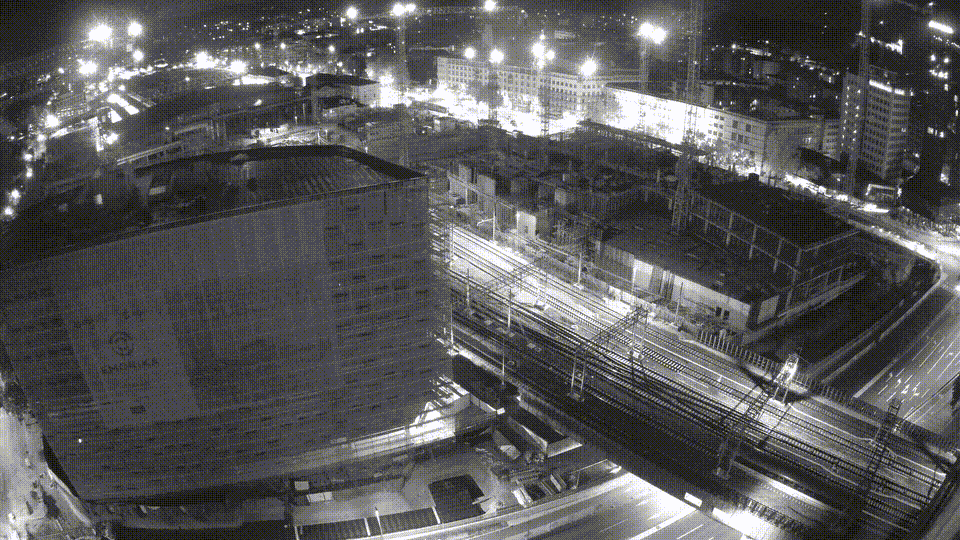

# Em0nika Timelapse

Avtomatsko spremljanje gradnje Emonike v Ljubljani.

Projekt uporablja GitHub Actions za samodejno zajemanje slik vsako uro in ustvarjanje arhiva napredka gradnje skozi čas.

<!-- TIMELAPSE_START -->
## 🎬 Zadnji dnevni timelapse

📅 **18.06.2026**

📸 Število slik: **26**



<!-- TIMELAPSE_END -->

## Kaj se shranjuje?

* 📷 Neposredni posnetek kamere (`lastsnapshot-emonika.jpeg`)


## Struktura

```text
slike/
├── emonika_slika_YYYY-MM-DD_HH-MM-SS.jpg
```

## Avtomatizacija

Zajem se izvaja samodejno preko GitHub Actions:

* vsakih 60 minut
* brez potrebe po lokalnem računalniku
* vsi posnetki se shranijo v repozitorij

## Namen

Cilj projekta je ustvariti dolgoročni vizualni arhiv gradnje Emonike in iz zbranih slik izdelati timelapse posnetke razvoja projekta skozi mesece in leta.

## Vir

* https://emonika.rvo.si/
* https://emonika.rvo.si/lastsnapshot-emonika.jpeg

---

*Neuraden projekt za spremljanje napredka gradnje Emonike.* (Miha hvala ti za idejo)
